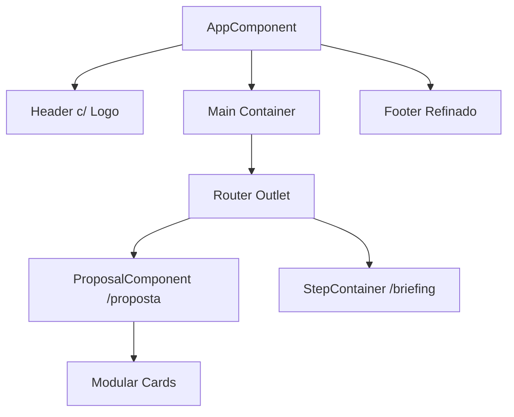

# 📝 Registro de Desenvolvimento — 2026-05-07

**Escopo:** Implementação da Página de Proposta e Refinamento de UI
**Commits gerados:** 3
**Arquivos modificados:** 12

---

## 1. Visão Geral das Alterações

Nesta sessão, foi implementada a página de proposta comercial (`/proposta`), projetada para apresentar ao cliente os detalhes do projeto de forma profissional e persuasiva. Além disso, a identidade visual do app foi refinada com a adição de logo oficial, atualização de metadados de SEO/Social e ajustes no layout global para um visual mais premium (Netflix-style).

---

## 2. Arquitetura Afetada

---

## 3. Mapa de Arquivos Modificados

| Arquivo                                                            | Tipo      | O que mudou                                                       |
| ------------------------------------------------------------------ | --------- | ----------------------------------------------------------------- |
| `design-state.md`                                                  | Doc       | Atualização do estado do design e links de documentação.          |
| `docs/designpowers/briefs/2026-05-07-proposal-page-brief.md`       | Doc       | Briefing detalhado da proposta.                                   |
| `docs/designpowers/strategy/2026-05-07-proposal-page-strategy.md`  | Doc       | Estratégia de conversão da página.                                |
| `docs/designpowers/plans/2026-05-07-proposal-page-plan.md`         | Doc       | Plano de implementação técnica.                                   |
| `docs/designpowers/critiques/2026-05-07-proposal-page-critique.md` | Doc       | Crítica de design e usabilidade.                                  |
| `src/app/features/proposal/proposal.component.ts`                  | Component | Implementação da lógica e template da página de proposta.         |
| `src/app/app.routes.ts`                                            | Config    | Adição da rota lazy-loaded para `/proposta`.                      |
| `src/app/app.ts`                                                   | Component | Atualização do Header (logo), Footer e cores de fundo (bg-black). |
| `src/index.html`                                                   | HTML      | Adição de tags OpenGraph/Twitter e troca do favicon por logo.svg. |
| `src/styles.css`                                                   | Style     | Ajustes globais de scroll e overflow.                             |
| `public/assets/logo.svg`                                           | Asset     | Logo oficial da MatheusDev.                                       |
| `public/assets/og-image.png`                                       | Asset     | Imagem para compartilhamento em redes sociais.                    |

---

## 4. Detalhamento por Commit

### `docs: registra progresso e adiciona documentação da página de proposta`

**Razão da alteração:**
Necessidade de formalizar os requisitos e o plano de execução da nova página antes da implementação para alinhamento com os padrões do Designpowers.

**O que faz agora:**
Provê rastreabilidade completa do processo de design e estratégia da Proposta.

**Arquivos envolvidos:**

- `design-state.md`
- `docs/designpowers/briefs/2026-05-07-proposal-page-brief.md`
- `docs/designpowers/critiques/2026-05-07-proposal-page-critique.md`
- `docs/designpowers/plans/2026-05-07-proposal-page-plan.md`
- `docs/designpowers/strategy/2026-05-07-proposal-page-strategy.md`

### `feat(proposta): implementa página de proposta modular com visual dashboard`

**Razão da alteração:**
Apresentação profissional do escopo, investimento e valor do projeto para o cliente aceitar.

**O que faz agora:**
Exibe uma página rica em detalhes com cards de escopo, cronograma, investimento e diferenciais técnicos em estilo dashboard.

**Decisões técnicas:**

- Uso de `Standalone Component` do Angular.
- Estrutura modular no HTML para fácil manutenção das seções.
- Smooth scroll para navegação interna (caso necessário futuramente).

**Arquivos envolvidos:**

- `src/app/features/proposal/proposal.component.ts`
- `src/app/app.routes.ts`

### `style(ui): atualiza layout global, cabeçalho, rodapé e metadados`

**Razão da alteração:**
Aumentar o valor percebido da plataforma (Look & Feel premium) e garantir boa visualização em redes sociais.

**O que faz agora:**
Aplica fundo preto profundo, logo oficial estilizada, footer minimalista e metadados OpenGraph/Twitter.

**Arquivos envolvidos:**

- `src/app/app.ts`
- `src/index.html`
- `src/styles.css`
- `public/assets/logo.svg`
- `public/assets/og-image.png`

---

## 5. ✅ O Que Está Funcionando

- [x] Rota `/proposta` acessível e funcional via lazy loading.
- [x] Layout responsivo com tema escuro consistente (Netflix-style).
- [x] Metadados de SEO/OpenGraph carregando corretamente.
- [x] Nova identidade visual aplicada (Header/Logo/Favicon).

---

## 6. ❌ O Que Está Pendente

- `[ ]` Botão de "Aceitar Proposta" — _atualmente apenas visual, sem integração de envio de dados._

---

## 7. ⚠️ Dívida Técnica Identificada

- **Otimização de Assets:** `og-image.png` deve ser verificado quanto ao peso para performance de carregamento.
- **Padronização de Espaçamento:** Alguns componentes usam paddings inline que poderiam ser abstraídos em classes utilitárias ou tokens de design.

---

## 8. Padrões Importantes a Lembrar

- **Identidade Visual:** Fundo `#000000` (bg-black) com detalhes em `netflix-red` (#E50914).
- **SEO:** Sempre manter os metadados `og:image` e `og:description` atualizados com o escopo do projeto.

---

## 9. Próximos Passos

1. Implementar o serviço de "Aceite" da proposta.
2. Adicionar animações de revelação (reveal animations) ao rolar a página de proposta.
3. Revisar acessibilidade (ARIA labels) nos novos elementos interativos.

---

## 10. Validações Mapeadas

| Campo / Função | Regra de validação                       | Status |
| -------------- | ---------------------------------------- | ------ |
| Rota Proposta  | Deve carregar sem erros no console F12   | ✅     |
| Responsividade | Deve ser usável em dispositivos de 320px | ✅     |
| SEO            | Social preview deve mostrar imagem OG    | ✅     |
